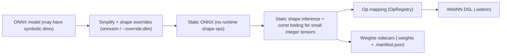

# Reference: ONNX → WebNN Lowering

This reference explains how `webnn-graph` lowers ONNX graphs into the WebNN DSL. It’s meant to be linked
from the project docs so new contributors understand the constraints, the required simplification, and the
operator mapping at a glance.

## Key concepts up front
- **Shape inference**: collect and propagate concrete shapes for every value. Inputs and initializers seed
  known shapes; integer constants feed shape math; ops like `MatMul`, `Transpose`, `Concat`, `Reduce*`,
  `Gather`, `Reshape` (with known newShape), etc., derive output shapes. If any shape stays symbolic,
  lowering stops with an error.
- **Const folding boundaries**: only small integer tensors used for shape/axes/newShape/starts/ends math are
  folded. Real weight tensors are never folded—they stay as external weights or inline bytes for tiny
  scalars. This keeps semantic fidelity while unlocking static shapes.
- **Serialization**: the `.webnn` output stores only structure (inputs, const declarations, nodes, outputs).
  Actual tensor bytes live in `model.weights` with offsets/types in `model.manifest.json`. Inline bytes are
  allowed for tiny scalars; everything else is referenced via `@weights("key")`.

## Why simplification is mandatory
- **WebNN is static**: all tensor shapes must be fully known at build time.
- **ONNX can be dynamic**: inputs often carry symbolic dims (e.g., `batch`, `seq_len`), and graphs may
  manipulate shapes at runtime (`Shape → Gather → Concat → Reshape` pipelines, dynamic `Slice`, etc.).
- **Goal**: arrive at a graph where every tensor shape is concrete and every shape-producing expression is
  either folded to a constant or rejected early with a clear error.


## Two-phase lowering
1) **Pre-simplify the ONNX graph to be static**
   - **Freeze input shapes**: use overrides or a simplifier to pin symbolic dims (e.g., `batch=1`,
     `seq_len=128`). The CLI accepts `--override-dim name=value`, and a sidecar `*.dims.json` can supply
     the same. Defaults kick in for common names (`batch`, `sequence_length`, etc.) when missing.
   - **Run an ONNX simplifier** (e.g., `onnxsim`) with overwrite-input-shape flags. This folds typical
     dynamic-shape plumbing such as:
     - `Shape` → `Gather` → `Concat` → `Reshape`
     - Constant axes/starts/ends passed around as tensors
   - **Result**: a static ONNX (`model-static.onnx`) that no longer encodes runtime shape logic.

2) **Lower the static graph to WebNN DSL**
   - **Opset guard**: only `ai.onnx` opset 11–18 is accepted.
   - **Shape/type seeding**: inputs (minus initializers) become WebNN inputs with concrete shapes;
     initializers become constants; integer constants are recorded for later shape math.
   - **Static shape inference**: a conservative pass rejects any remaining dynamic dims, infers shapes for
     intermediates, and folds small integer tensors needed for axes/newShape/starts/ends.
   - **Optional extra propagation** (`--optimize`): a few lightweight passes try to derive more shapes and
     fold more integer consts (Shape/Gather/Concat/Cast/Squeeze/Unsqueeze).
   - **Node conversion**: each ONNX node is mapped to one or more WebNN ops via `OpRegistry`; purely
     constant outputs are emitted as consts and skipped as nodes.
   - **Serialization**: emit `.webnn` (structure only) plus `.weights` and `.manifest.json` (raw bytes +
     offsets). Inline bytes are used only for tiny scalars; real tensors use `@weights("key")`.

### Flow at a glance



## How dynamic constructs are handled
- **Symbolic input dims**: must be resolved before lowering (overrides, defaults, or simplifier). If
  anything is still symbolic, conversion errors with a targeted message.
- **Shape-producing ops** (`Shape`, `Gather`, `Concat`, `Unsqueeze`, `Squeeze`, `Cast` of ints):
  - If the inputs are compile-time constants, the converter folds them and records both the values and
    shapes.
  - If not foldable, the op is left as a WebNN `shape`/`gather`/`concat`/`unsqueeze`/`squeeze` node, but
    only when its shape impact is already known and compatible with WebNN.
- **Reshape**:
  - Requires `newShape` to be fully known. The converter pulls it from constant tensors or folded const
    values; `-1` is resolved using the input element count.
  - If `newShape` is not fully static, conversion fails with a clear “WebNN requires static newShape” error.
- **Slice**:
  - Starts/ends/axes/steps must be constants. Steps other than 1 are rejected. Negative indices are
    normalized using known input dims. Unknown dims lead to a failure.
- **Gather**:
  - Axis is normalized; if both data and indices are constant, it is folded. Otherwise, shape inference
    ensures the output shape is determined.
- **Transpose/Concat/Split/Unsqueeze/Squeeze**:
  - Permutations/axes must be known. Concat requires all input shapes known; otherwise, conversion stops.
- **Constant folding scope**:
  - Only small integer tensors used for shape math are folded. Real weight tensors are never folded; they
    are carried through to the weights file.

### Before/after examples for common tricky patterns
- **Dynamic reshape pipeline**  
  - Original ONNX: `X -> Shape -> Gather -> Concat -> Reshape(X, newShape=tensor)` with symbolic dims.  
  - After `onnxsim`: `newShape` becomes a constant tensor (e.g., `[1,128,12,32]`); `Shape/Gather/Concat`
    are removed.  
  - After WebNN lowering: a single `reshape(X, newShape=[1,128,12,32])` node; `newShape` is static and
    embedded as an inline small const if needed.
  ```mermaid
  flowchart LR
    A[X] --> B[Shape]
    B --> C[Gather]
    C --> D[Concat]
    D --> E["Reshape X,newShape=tensor"]
    subgraph onnxsim
      F[X] --> G["Reshape X,newShape=[1,128,12,32]"]
    end
    subgraph webnn
      H["reshape(X,[1,128,12,32])"]
    end
  ```
- **Slice with computed bounds**  
  - Original ONNX: `starts`/`ends`/`axes`/`steps` produced by small subgraphs.  
  - After `onnxsim`: those tensors become constants with normalized axes; negative indices are resolved.  
  - After WebNN lowering: one `slice` node with static starts/ends/axes/steps; rejected if any bound stays
    dynamic or `step != 1`.
  ```mermaid
  flowchart LR
    A[starts subgraph] --> B[Slice]
    C[ends subgraph] --> B
    D[axes subgraph] --> B
    E[steps subgraph] --> B
    subgraph onnxsim
      F[starts const] --> G["Slice(static)"]
      H[ends const] --> G
      I[axes const] --> G
      J[steps const] --> G
    end
    subgraph webnn
      K[slice static bounds]
    end
  ```
- **Axis/permute tensors**  
  - Original ONNX: axes for `Unsqueeze`/`Squeeze`/`Reduce*` or perm for `Transpose` are fed by tensors.  
  - After `onnxsim`: axes/perm are folded into constant tensors.  
  - After WebNN lowering: ops carry inline static `axes` or `permutation` arrays; if still dynamic, the op
    is rejected.
  ```mermaid
  flowchart LR
    A[axes tensor] --> B[Unsqueeze]
    subgraph onnxsim
      C[axes const] --> D["Unsqueeze axes=[1,3]"]
    end
    subgraph webnn
      E["unsqueeze axes=[1,3]"]
    end
  ```
- **Gather for shape math**  
  - Original ONNX: `Gather(Shape(X), idx)` to pick a dim.  
  - After `onnxsim`: `Shape` and `Gather` are removed and replaced by a scalar constant (e.g., sequence
    length).  
  - After WebNN lowering: the scalar becomes an inline const; no `gather` node is emitted.
  ```mermaid
  flowchart LR
    A[X] --> B[Shape]
    B --> C[Gather idx]
    subgraph onnxsim
      D[const dim]:::const
    end
    subgraph webnn
      E[inline scalar const]:::const
    end
    classDef const fill:#eef,stroke:#66f;
  ```
- **Broadcasted elementwise ops**  
  - Original ONNX: elementwise ops rely on runtime broadcasting.  
  - After `onnxsim`: shapes are static and compatible; broadcasting stays implicit.  
  - After WebNN lowering: elementwise ops are emitted as-is; shapes are already known, so no extra shape
    ops are needed.
  ```mermaid
  flowchart LR
    A["X (static shape)"] --> C[Add]
    B["Y (static shape)"] --> C
    subgraph webnn
      D["add(X,Y) with inferred broadcast"]
    end
  ```

 

## Operator mapping (ONNX → WebNN)
- **MatMul/Gemm**: `matmul` (plus optional transposes, alpha/beta scaling, and bias add for Gemm).
  Transposes are emitted as separate `transpose` nodes when requested.
- **Elementwise**: `Add`, `Sub`, `Mul`, `Div`, `Pow` map directly to WebNN elementwise ops with
  broadcasted shapes already inferred.
- **Activations**: `Relu`, `Gelu`, `Tanh`, `Sigmoid`, `Sqrt`, `Exp`, `Log`, `Abs`, `Neg`, `Erf` map
  one-to-one.
- **Normalization**: `LayerNormalization` (with epsilon/axes) and `Softmax` (axis).
- **Reshape family**: `Reshape`, `Transpose`, `Concat`, `Split`, `Unsqueeze`, `Squeeze` with static
  axes/newShape/permutation; failures if not static.
- **Utility**: `Shape`, `Gather`, `Slice` as described above; `Cast` with supported dtype mapping.
- **Reductions**: `ReduceMean`, `ReduceSum`, `ReduceMax`, `ReduceMin` with `axes` and `keepdims`.

Unsupported ops (or ops with remaining dynamism) fail fast with an explicit “unsupported operator” or
“WebNN requires static …” message to keep the pipeline predictable.

 

## End-to-end recipe (anchor example: `all-MiniLM-L6-v2-webnn`)
1) **Simplify to static** (pin batch/seq and fold dynamic shape ops):
   - `onnxsim model.onnx model-static.onnx \\
     --overwrite-input-shape input_ids:1,128 \\
     --overwrite-input-shape attention_mask:1,128 \\
     --overwrite-input-shape token_type_ids:1,128`
2) **Lower to WebNN** (enforce static shapes, map ops, write weights/manifest):
   - `webnn-graph convert-onnx --input model-static.onnx --output model.webnn --weights model.weights \\
     --manifest model.manifest.json --optimize`
3) **Artifacts**
   - `model.webnn`: structure-only graph; inputs pinned; consts reference `@weights("…")` or inline tiny
     scalars; nodes are WebNN ops with sanitized IDs; outputs expose `last_hidden_state`.
   - `model.weights`: raw little-endian tensor bytes, concatenated.
   - `model.manifest.json`: dtype/shape/byte offsets for every `@weights` tensor.
